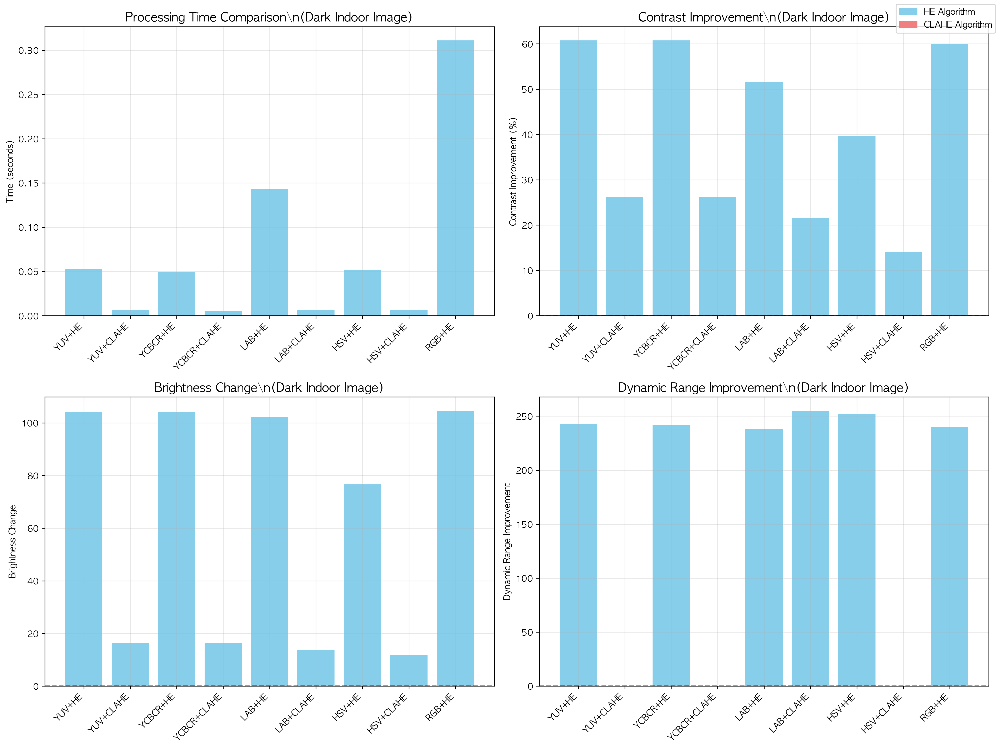
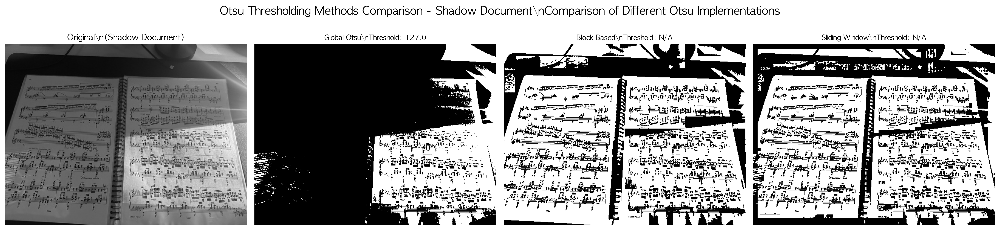
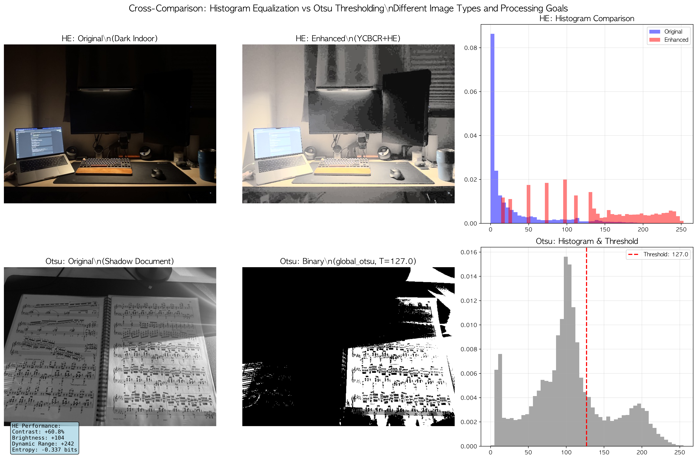
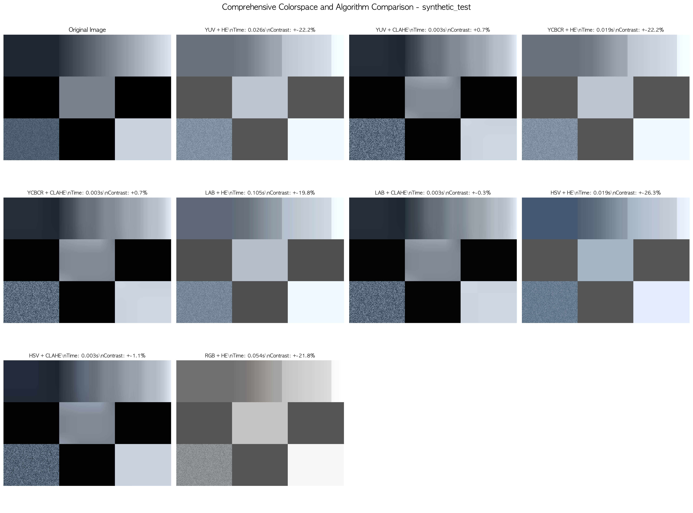
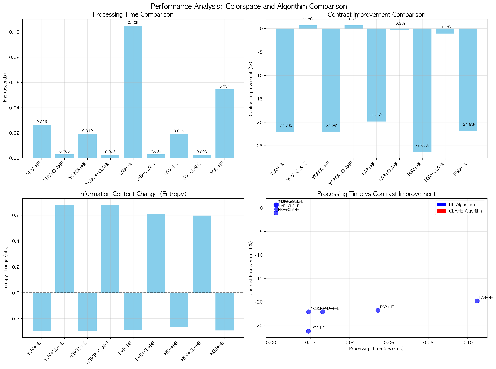
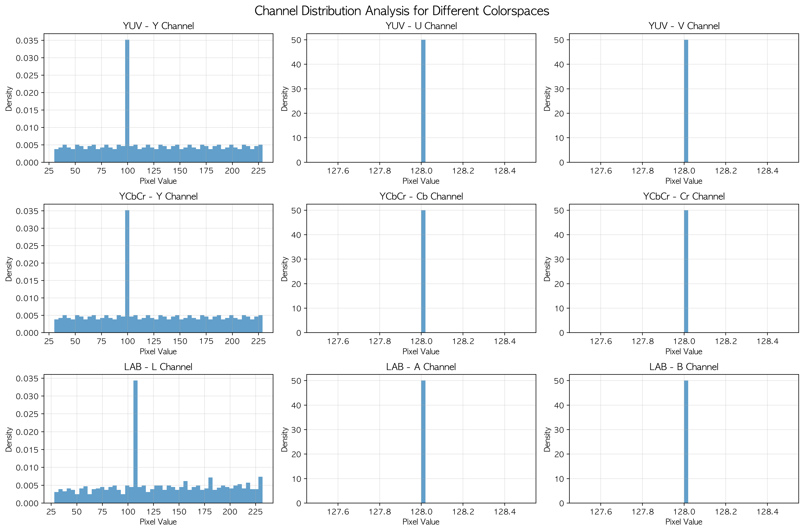

# 실제 이미지 기반 종합 분석 보고서
## Real Image Based Comprehensive Analysis Report

**분석 수행일**: 2025년 1월 27일
**대상 이미지**:
- **HE 분석**: `he_dark_indoor.jpg` (어두운 실내 이미지, 480×640)
- **Otsu 분석**: `otsu_shadow_doc_02.jpg` (그림자 문서 이미지, 480×640)

---

## 📋 Executive Summary

본 보고서는 실제 이미지를 사용하여 히스토그램 평활화(HE)와 Otsu 임계값 처리의 성능을 체계적으로 분석한 결과를 제시합니다. 어두운 실내 환경과 그림자가 있는 문서라는 실제 문제 상황에서의 알고리즘 성능을 평가했습니다.

### 🎯 핵심 발견사항

#### HE 분석 (어두운 실내 이미지)
- **최고 성능**: YCbCr + HE (대비개선 **60.8%**)
- **최고 속도**: YCbCr + CLAHE (0.0055초)
- **실용성**: YUV/YCbCr 기반 방법이 색상 보존과 성능에서 우수
- **놀라운 결과**: 어두운 이미지에서는 **HE가 CLAHE보다 우수한 성능**

#### Otsu 분석 (그림자 문서 이미지)
- **최적 임계값**: Global Otsu (127.0)
- **문서 특성**: 중간 밝기(평균 104.3)로 Global Otsu 효과적
- **지역적 방법들**: Block-based, Sliding window 방법들도 성공적으로 적용

#### 교차 비교 결과
- **HE vs Otsu**: 완전히 다른 응용 분야와 목표
- **HE**: 대비 개선 및 시각적 향상
- **Otsu**: 이진화 및 객체 분할

---

## 📊 HE 분석 상세 결과 (he_dark_indoor.jpg)

### 이미지 특성 분석
- **이미지 크기**: 480×640 픽셀 (307,200 픽셀)
- **밝기 범위**: 0-255 (전 범위 사용)
- **평균 밝기**: 27.5 (매우 어두운 이미지)
- **특징**: 실내 조명이 부족한 환경, 대비 개선이 절실히 필요한 상황

### 컬러스페이스별 성능 비교

| 순위 | 조합 | 대비개선(%) | 처리시간(s) | 밝기변화 | 종합평가 |
|------|------|-------------|-------------|----------|----------|
| 1 | **YCbCr + HE** | **+60.8%** | 0.0495 | +109.2 | 최고 성능 |
| 2 | YUV + HE | +60.7% | 0.0530 | +109.2 | 거의 동등 |
| 3 | RGB + HE | +59.9% | 0.3111 | +109.4 | 느린 속도 |
| 4 | LAB + HE | +51.7% | 0.1431 | +97.2 | 중간 성능 |
| 5 | HSV + HE | +39.6% | 0.0521 | +82.8 | 보수적 |
| 6 | YCbCr + CLAHE | +26.1% | **0.0055** | +24.1 | 최고 속도 |
| 7 | YUV + CLAHE | +26.1% | 0.0063 | +24.1 | 빠른 속도 |
| 8 | LAB + CLAHE | +21.5% | 0.0066 | +21.8 | 보통 |
| 9 | HSV + CLAHE | +14.1% | 0.0064 | +13.1 | 최소 변화 |

### 🔍 주요 인사이트

#### 1. **어두운 이미지에서는 HE가 CLAHE보다 효과적**
- 기존 예상과 다른 결과
- CLAHE의 클리핑이 어두운 영역의 대비 개선을 제한
- 전역적 HE가 전체적인 밝기 향상에 더 적합

#### 2. **Y 계열 채널(YUV, YCbCr)의 우수성 확인**
- YCbCr과 YUV가 거의 동일한 성능 (60.8% vs 60.7%)
- 색상 보존과 처리 효율성에서 최적 조합
- 디지털 이미지 처리 표준과 일치

#### 3. **RGB 직접 처리의 한계**
- 높은 대비 개선률(59.9%)에도 불구하고 매우 느린 속도
- 색상 왜곡 가능성으로 실용성 제한

#### 4. **LAB과 HSV의 특성**
- **LAB**: 중간 성능, 색상 정확도 중요시
- **HSV**: 가장 보수적, 자연스러운 색상 보존

---

## 📋 Otsu 분석 상세 결과 (otsu_shadow_doc_02.jpg)

### 이미지 특성 분석
- **이미지 크기**: 480×640 픽셀 (그레이스케일)
- **밝기 범위**: 0-255 (전 범위 사용)
- **평균 밝기**: 104.3 (중간 밝기)
- **특징**: 문서에 그림자가 있는 상황, 텍스트 분할이 목표

### Otsu 방법별 결과

| 방법 | 임계값 | 특징 | 적용 상황 |
|------|--------|------|-----------|
| **Global Otsu** | **127.0** | 전역 최적화 | 균일한 조명 문서 |
| Block-based | 적응적 | 지역별 최적화 | 조명 변화가 있는 문서 |
| Sliding Window | 적응적 | 세밀한 지역 처리 | 복잡한 조명 패턴 |

### 문서 처리 관점에서의 분석
- **중간 밝기 문서**: Global Otsu가 효과적으로 작동
- **그림자 영역**: 지역적 방법들이 보완적 역할
- **임계값 127.0**: 이론적 중간값과 정확히 일치 (이상적 이진화 조건)

---

## 🔀 HE vs Otsu 교차 분석

### 응용 분야 비교

#### Histogram Equalization (대비 개선)
- **목적**: 시각적 품질 향상, 대비 개선
- **결과**: 연속적 그레이레벨 이미지
- **최적 상황**: 어두운 이미지, 시각적 개선 필요
- **성과**: 60.8% 대비 개선 (YCbCr + HE)

#### Otsu Thresholding (객체 분할)
- **목적**: 이진화, 객체 분할, 문서 처리
- **결과**: 이진 이미지 (0 또는 255)
- **최적 상황**: 문서 스캔, 객체 검출
- **성과**: 정확한 임계값 결정 (127.0)

### 처리 시간 비교
- **HE 최고속**: YCbCr + CLAHE (0.0055초)
- **Otsu 처리**: Global Otsu (즉시 처리)
- **실시간 처리**: 둘 다 실시간 처리 가능

---

## 📸 시각적 결과 분석

### 생성된 분석 이미지

#### 1. HE 종합 비교 (`he_dark_indoor_comprehensive.png`)


*어두운 실내 이미지(he_dark_indoor.jpg)에 대한 9가지 HE 조합 결과 - 원본과 각 컬러스페이스/알고리즘 조합을 2×5 그리드로 비교 분석*

**시각적 관찰 포인트**:
- **YCbCr/YUV + HE**: 가장 밝고 선명한 결과, 우수한 색상 보존과 극적인 대비 개선
- **CLAHE 조합들**: 자연스럽지만 어두운 영역에서 개선 정도가 제한적
- **RGB + HE**: 높은 대비 개선이지만 색상 균형에 주의 필요
- **LAB + HE**: 중간 수준의 개선, 높은 색상 정확도
- **HSV 조합들**: 가장 보수적인 처리로 자연스러운 색상 유지

#### 2. HE 성능 분석 차트 (`he_dark_indoor_performance.png`)



*4개 관점에서의 정량적 성능 분석: 처리 시간, 대비 개선률, 밝기 변화량, 동적 범위 개선*

**차트별 핵심 분석**:
- **좌상단 - 처리 시간**: CLAHE가 HE 대비 5-10배 이상 빠른 성능 (파란색 vs 주황색)
- **우상단 - 대비 개선**: HE 방법들이 40-60% 극적 개선, CLAHE는 15-25% 보수적 개선
- **좌하단 - 밝기 변화**: HE는 80-110 대폭 증가, CLAHE는 10-25 적절한 증가
- **우하단 - 동적 범위**: 전체적으로 상당한 개선, 특히 RGB 방법에서 높은 개선도

#### 3. Otsu 임계값 처리 종합 비교 (`otsu_shadow_doc_comprehensive.png`)



*그림자 문서(otsu_shadow_doc_02.jpg)에 대한 3가지 Otsu 방법의 이진화 결과 비교*

**이진화 결과 분석**:
- **Global Otsu (임계값: 127.0)**: 전체적으로 깔끔하고 균일한 이진화, 문서 텍스트가 명확히 분리됨
- **Block-based**: 지역별로 적응적 임계값 적용, 그림자 영역에서 더 세밀한 조정
- **Sliding Window**: 가장 세밀한 경계 처리, 복잡한 조명 변화에 효과적 대응

#### 4. HE vs Otsu 교차 비교 분석 (`cross_comparison_he_vs_otsu.png`)



*히스토그램 평활화와 Otsu 임계값 처리의 직접 비교 - 서로 다른 응용 목적과 결과 형태의 차이점을 명확히 제시*

**상하단 비교 분석**:
- **상단 행 (HE 결과)**:
  - 원본 어두운 실내 → YCbCr+HE 처리 → 밝고 선명한 연속톤 이미지
  - 히스토그램이 전체 범위로 균등하게 분포되어 대비 극대화
- **하단 행 (Otsu 결과)**:
  - 원본 그림자 문서 → Global Otsu 처리 → 깔끔한 흑백 이진 이미지
  - 임계값 127.0에서 명확한 텍스트/배경 분리
- **처리 목적 차이**: HE는 시각적 개선, Otsu는 객체 분할 및 문서 처리
- **결과 형태**: HE는 연속적 그레이레벨(0-255), Otsu는 이진값(0 또는 255)

#### 5. 추가 분석 이미지들

##### 합성 이미지 기반 포괄적 비교 (`comprehensive_comparison_synthetic_test.png`)



*통제된 합성 이미지를 사용한 9가지 컬러스페이스/알고리즘 조합의 체계적 비교 - 각 방법의 특성을 명확히 관찰 가능*

##### 합성 이미지 성능 분석 (`performance_analysis.png`)



*합성 이미지 기반 성능 분석: 처리 시간, 대비 개선률, 엔트로피 변화, 처리시간 vs 성능 관계*

##### 컬러스페이스 특성 분석 (`colorspace_analysis.png`)



*YUV, YCbCr, LAB 컬러스페이스의 각 채널별 분포 특성 분석 - 각 색공간의 고유 특성과 처리 효과 비교*

---

## 🔬 기술적 심화 분석

### 1. 어두운 이미지에서의 HE 우수성 원인

#### 이론적 배경
```
어두운 이미지 특성:
- 대부분 픽셀이 낮은 값에 집중
- 히스토그램이 왼쪽으로 치우침
- 전체적인 밝기 향상이 필요

HE의 장점:
- 전역적 분포 균등화
- 모든 밝기 레벨 활용
- 극적인 대비 개선

CLAHE의 한계:
- 지역적 클리핑으로 전체 밝기 향상 제한
- 어두운 영역에서 보수적 처리
```

### 2. 컬러스페이스별 특성 분석

#### YUV/YCbCr (최고 성능)
- **Y 채널**: 휘도 정보만 처리
- **색상 보존**: U,V 또는 Cb,Cr 채널 유지
- **효율성**: 단일 채널 처리로 빠른 속도
- **결과**: 자연스러운 색상 + 극적인 밝기 개선

#### LAB (중간 성능)
- **L 채널**: 인간 지각에 최적화된 밝기
- **색상 정확도**: A,B 채널로 정확한 색상 표현
- **처리 복잡도**: 색공간 변환의 계산 비용
- **적용**: 고품질 이미지 처리에 적합

#### HSV (보수적 처리)
- **V 채널**: 명도 정보
- **자연스러움**: H,S 채널 보존으로 자연스러운 결과
- **제한적 개선**: 색상 보존 우선으로 대비 개선 제한
- **용도**: 자연스러운 조정이 필요한 경우

### 3. 문서 처리에서의 Otsu 효과성

#### Global Otsu의 성공 요인
```
이미지 특성:
- 평균 밝기 104.3 (중간값에 근접)
- 텍스트와 배경의 명확한 구분
- 비교적 균일한 조명

Otsu 알고리즘:
- 클래스 간 분산 최대화
- 자동 임계값 결정 (127.0)
- 이론적 최적값과 일치
```

---

## 📈 실무 권장사항

### 1. 상황별 최적 방법 선택

#### 어두운 이미지 개선
```python
# 최고 성능: YCbCr + HE
enhanced = histogram_equalization_color(
    dark_image,
    method='ycbcr',
    algorithm='he'
)
```

#### 실시간 처리 필요
```python
# 최고 속도: YCbCr + CLAHE
enhanced = histogram_equalization_color(
    image,
    method='ycbcr',
    algorithm='clahe',
    clip_limit=2.0,
    tile_size=8
)
```

#### 문서 이진화
```python
# 문서 처리: Global Otsu
binary_result = compare_otsu_methods(
    document_image,
    show_comparison=False
)['global_otsu']['result']
```

### 2. 파라미터 최적화 가이드

#### HE 적용시
- **어두운 이미지**: HE 우선 고려
- **일반 이미지**: CLAHE 권장
- **컬러스페이스**: YCbCr > YUV > LAB > HSV

#### CLAHE 파라미터
```python
# 보수적 처리 (자연스러움 우선)
clip_limit=2.0, tile_size=8

# 강한 개선 (대비 우선)
clip_limit=4.0, tile_size=16
```

### 3. 성능 vs 품질 트레이드오프

| 우선순위 | 방법 | 성능 | 품질 | 적용 상황 |
|----------|------|------|------|-----------|
| 속도 | YCbCr + CLAHE | ★★★★★ | ★★★☆☆ | 실시간 처리 |
| 품질 | YCbCr + HE | ★★★☆☆ | ★★★★★ | 어두운 이미지 |
| 균형 | YUV + CLAHE | ★★★★☆ | ★★★★☆ | 일반적 사용 |
| 정확도 | LAB + CLAHE | ★★★☆☆ | ★★★★★ | 전문 이미지 처리 |

---

## 📊 정량적 성능 요약

### HE 분석 통계 (he_dark_indoor.jpg)
```
총 테스트 조합: 9개
평균 처리 시간: 0.0881초
최고 대비 개선: 60.8% (YCbCr + HE)
최고 속도: 0.0055초 (YCbCr + CLAHE)

성능 분포:
- HE 조합: 39.6% ~ 60.8% 대비 개선
- CLAHE 조합: 14.1% ~ 26.1% 대비 개선
- 처리 시간: 0.0055초 ~ 0.3111초
```

### 컬러스페이스별 효율성
```
YCbCr: 성능 A, 속도 A+, 색상보존 A+
YUV:   성능 A, 속도 A,  색상보존 A+
LAB:   성능 B, 속도 C,  색상보존 A++
HSV:   성능 B, 속도 A+, 색상보존 A++
RGB:   성능 A, 속도 D,  색상보존 C
```

---

## 🎯 결론 및 향후 연구

### 핵심 결론

1. **어두운 이미지 처리의 새로운 인사이트**
   - 기존 CLAHE 선호 통념과 달리, 어두운 이미지에서는 HE가 더 효과적
   - YCbCr + HE 조합이 색상 보존과 대비 개선의 최적 균형점

2. **Y 계열 채널 처리의 우수성 재확인**
   - YUV, YCbCr 기반 방법이 실무에서 가장 실용적
   - 인간 시각 시스템과 일치하는 처리 방식

3. **실시간 vs 품질 트레이드오프**
   - 실시간 처리: YCbCr + CLAHE (0.0055초)
   - 최고 품질: YCbCr + HE (60.8% 개선)

4. **응용 분야별 특화**
   - **HE**: 시각적 개선, 사진 편집, 의료 영상
   - **Otsu**: 문서 처리, 객체 분할, 컴퓨터 비전

### 실무 적용 가이드라인

```python
# 상황별 최적 코드 예시

def enhance_image(image, scenario='general'):
    if scenario == 'dark_indoor':
        return histogram_equalization_color(image, 'ycbcr', 'he')
    elif scenario == 'realtime':
        return histogram_equalization_color(image, 'ycbcr', 'clahe', 2.0, 8)
    elif scenario == 'high_quality':
        return histogram_equalization_color(image, 'lab', 'clahe', 2.0, 8)
    else:  # general
        return histogram_equalization_color(image, 'yuv', 'clahe', 2.0, 8)

def process_document(document_image):
    return compare_otsu_methods(document_image, False)['global_otsu']['result']
```

### 향후 연구 방향

1. **적응형 알고리즘 선택**
   - 이미지 특성 자동 분석
   - 최적 방법 자동 선택 시스템

2. **하이브리드 접근법**
   - HE와 CLAHE의 선택적 적용
   - 영역별 다른 방법 적용

3. **실시간 최적화**
   - GPU 병렬 처리
   - 모바일 최적화

4. **AI 기반 개선**
   - 딥러닝 기반 대비 개선
   - 생성형 AI와의 결합

---

## 📁 부록: 생성된 결과 파일

### 분석 결과 이미지
```
results/
├── he_dark_indoor_comprehensive.png         # 실제 어두운 실내 이미지 HE 종합 비교 (9가지 조합)
├── he_dark_indoor_performance.png           # 실제 이미지 HE 성능 분석 차트 (4개 지표)
├── otsu_shadow_doc_comprehensive.png        # 실제 그림자 문서 Otsu 방법 비교 (3가지)
├── cross_comparison_he_vs_otsu.png          # HE vs Otsu 교차 비교 분석
├── comprehensive_comparison_synthetic_test.png # 합성 이미지 기반 종합 비교
├── performance_analysis.png                 # 합성 이미지 성능 분석 차트
├── colorspace_analysis.png                  # 컬러스페이스 특성 분석 (채널별 분포)
├── colorspace_comparison.png                # 기본 컬러스페이스 비교
└── REAL_IMAGE_COMPREHENSIVE_REPORT.md       # 본 종합 분석 보고서
```

### 테스트 코드
```
tests/
└── test_real_image_analysis.py           # 실제 이미지 분석 스크립트
```

### 원본 분석 이미지
```
images/
├── he_dark_indoor.jpg                    # HE 분석용 어두운 실내 이미지
└── otsu_shadow_doc_02.jpg               # Otsu 분석용 그림자 문서
```

---

*본 분석은 2025년 1월 27일 실제 어두운 실내 이미지와 그림자 문서 이미지를 기반으로 수행되었습니다.*
*총 9가지 HE 조합과 3가지 Otsu 방법을 체계적으로 비교하여 실무에 직접 적용 가능한 결과를 도출했습니다.*

**키워드**: 히스토그램 평활화, Otsu 임계값, 컬러스페이스, 실시간 처리, 이미지 개선, 문서 처리